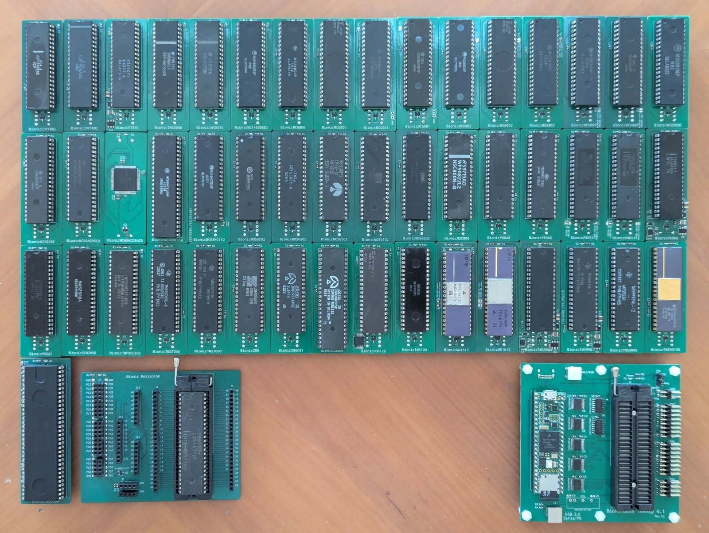
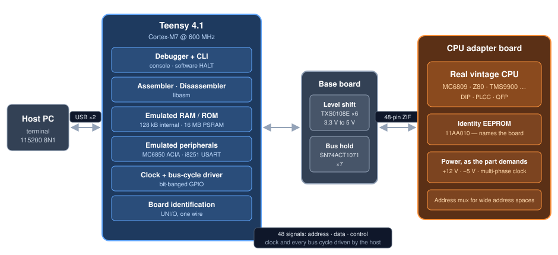
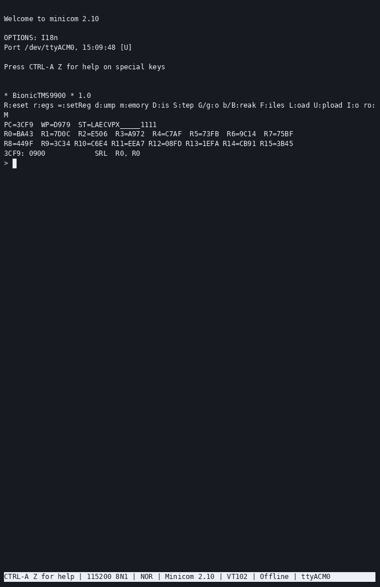

# retro-bionic

**Run real vintage CPUs on a modern Cortex-M7 — with a debugger, assembler and disassembler built in.**

## Contents

- [CPUs](docs/supported-cpus.md) — every target supported and planned, with the variants each detects
- [Hardware](docs/hardware.md) — the board stack, signal naming and the awkward chips
- [Debugger](docs/debugger.md) — full command reference
- [Build & run](docs/build.md) — toolchain, flashing, serial ports
- [Samples](docs/samples.md) — the programs and how to run them
- [Demos](docs/demos.md) — recorded terminal sessions for 20 CPUs

## What is this?

Put a real MC6809, Z80, TMS9900 or CDP1802 into a ZIF socket and single-step it, one bus
cycle at a time, from a terminal on your desk.

**Bionic** runs *genuine* vintage processors — not emulations of them. A
[Teensy 4.1](https://www.pjrc.com/store/teensy41.html) is wired to every pin of the target
CPU and drives the whole system around it: the clock, every bus cycle, and the memory and
peripherals the chip thinks it is talking to. One firmware image — about 300 kB including
every assembler, disassembler and debugger — covers all **40 supported targets**, and the
board tells the controller which one it is.

The hardware is two boards:

1. **Base** — the Teensy 4.1, five TXS0108E level shifters for 3.3 V ↔ 5 V translation, data
   bus holders, the 48-pin ZIF socket and the HALT/RUN switch.
2. **CPU adapter** — one small board per processor, holding little more than the chip
   itself, its identity EEPROM and whatever power the part demands. The TMS9900 board, for
   example, generates its own +12 V and −5 V rails and a non-overlapping four-phase clock, and CPUs with
   large address spaces carry an address bus multiplexer.

The 48 signals crossing the connector are named `P10`–`P57`, and each CPU board maps them to
its own pinout in a small TOML file. See **[docs/hardware.md](docs/hardware.md)**.

## Debugger features

- **Single-step a physical CPU** and print every bus cycle it performed (`S`).
- **Live disassembly** of the next instruction after each register dump, via
  [libasm](https://github.com/tgtakaoka/libasm).
- **Registers** read back by injecting instructions and capturing the resulting cycles —
  read and write them (`r`, `=`).
- **Breakpoints**, up to 4 plus one temporary for run-until-address (`B`, `b`, `g`).
- **Memory** dump and patch, separate program and data spaces for Harvard architectures
  (`d`, `p`, `m`, `M`), plus a write-protect area on targets that need one (`P`).
- **Upload** Intel HEX or Motorola S-record straight over the serial link (`U`).
- **Emulated peripherals** — MC6850 ACIA and i8251 USART — and on-chip serial ports of MCU
  targets bridged to your terminal (`I`).
- **Automatic board identification** from a UNI/O serial EEPROM, plus **runtime variant
  detection**: one 6502 board reports `MOS6502`, `G65SC02`, `R65C02`, `W65C02S` or
  `W65C816S` depending on which die actually responds.

 <em>A <a href="https://asciinema.org/a/721668">real TMS9900 session</a>: registers,
disassembly, single-stepping with the bus trace, then drawing the Mandelbrot set.</em>

## Supported CPUs

All 40 targets, grouped by vendor and architecture:

<table>
<thead>
<tr><th>Vendor</th><th>Architecture</th><th>Targets</th></tr>
</thead>
<tbody>
<tr><td rowspan="3">Motorola</td><td>6800</td><td>MC6800 <em>MB8861</em>, MC6801 <em>HD6301</em>, MC6802 <em>MB8870</em>, MC68HC11A, MC68HC11D</td></tr>
<tr><td>6805</td><td>MC146805E2, MC68HC05C0, MC68HC08AZ0</td></tr>
<tr><td>6809</td><td>MC6809 <em>HD6309</em>, MC6809E <em>HD6309E</em></td></tr>
<tr><td>MOS Technology</td><td>6502</td><td>MOS6502 <em>G65SC02, R65C02, W65C02S, W65C816S</em></td></tr>
<tr><td rowspan="2">Zilog</td><td>Z80</td><td>Z80, Z180, NSC800, KL5C80A12, HD64180S</td></tr>
<tr><td>Z8</td><td>Z86C91, Z88C00</td></tr>
<tr><td rowspan="4">Intel</td><td>MCS-48</td><td>P8039 <em>MSM80C39</em></td></tr>
<tr><td>MCS-51</td><td>P8051</td></tr>
<tr><td>MCS-80/85</td><td>P8080, P8085</td></tr>
<tr><td>MCS-96</td><td>P8095BH</td></tr>
<tr><td rowspan="4">Texas Instruments</td><td>TMS9900</td><td>TMS9900, TMS9980, TMS9981, TMS9995, TMS99105 <em>TMS99110</em></td></tr>
<tr><td>TMS7000</td><td>TMS7000 <em>TMS7002</em></td></tr>
<tr><td>TMS370</td><td>TMS370Cx5x</td></tr>
<tr><td>TMS320</td><td>TMS320C15</td></tr>
<tr><td>DEC</td><td>PDP-8</td><td>IM6100, HD6120</td></tr>
<tr><td>RCA</td><td>COSMAC</td><td>CDP1802 <em>CDP1804A</em></td></tr>
<tr><td>Fairchild</td><td>F8</td><td>F3850</td></tr>
<tr><td rowspan="2">National</td><td>SC/MP II</td><td>INS8060</td></tr>
<tr><td>SC/MP III</td><td>INS8070</td></tr>
<tr><td>Signetics</td><td>2650</td><td>SCN2650</td></tr>
<tr><td>Toshiba</td><td>TLCS-90</td><td>TMP90C802</td></tr>
<tr><td>Panafacom</td><td>MN1610</td><td>MN1613 <em>MN1613A</em></td></tr>
</tbody>
</table>

Targets in *italics* are variants the firmware identifies at runtime, by executing
instructions that behave differently on each die — not by anything written on the board.

See **[docs/supported-cpus.md](docs/supported-cpus.md)** for the full table, including the
CPUs still to be supported.

## Repository layout

| Path | Contents |
|---|---|
| [`debugger/`](debugger) | Teensy 4.1 firmware — shared framework plus 22 per-family back ends |
| [`schematics/`](schematics) | KiCad projects: base, mezzanine and 46 CPU adapter boards, with gerbers and PDFs |
| [`pinout/`](pinout) | Pin-map definitions consumed by [dip](https://github.com/tgtakaoka/dip) |
| [`samples/`](samples) | Test programs — Mandelbrot, arithmetic suites, serial echo — ported to every CPU |
| [`scripts/`](scripts) | PlatformIO helper for generating `compile_commands.json` |

## Related projects

| Project | Role |
|---|---|
| [**libasm**](https://github.com/tgtakaoka/libasm) | The assembler and disassembler engine — 40 architectures, 102 CPU variants, small enough to run on an AVR |
| [**libcli**](https://github.com/tgtakaoka/libcli) | The serial command-line front end the debugger is built on |
| [**dip**](https://github.com/tgtakaoka/dip) | Draws the pinout diagrams from the TOML files in [`pinout/`](pinout) |

## Resources

- **Recorded sessions** — [asciinema.org/~tgtakaoka](https://asciinema.org/~tgtakaoka)
- **Progress log** — [Bluesky](https://bsky.app/profile/tgtakaoka.bsky.social) ·
  [X](https://x.com/tgtakaoka)

## License

Licensed under the [Apache License, Version 2.0](LICENSE.md).
