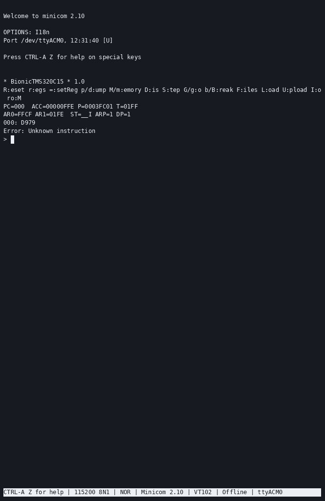

# Debugger

The controller presents a single-letter command REPL over USB serial, built on
[libcli](https://github.com/tgtakaoka/libcli). Connect at **115200 8N1**.

<div align="center">

<br><em>A <a href="https://asciinema.org/a/723753">TMS320C15 session</a> running the
same Mandelbrot program as every other target.</em>
</div>

## Commands

From the header of `debugger/debugger.cpp`:

| Key | Action |
|---|---|
| `R` | Reset CPU |
| `r` | Print CPU registers |
| `=` | Set a CPU register |
| `d` | Dump data memory — `addr [length]` |
| `p` | Dump program memory — `addr [length]` |
| `m` | Read/write data memory |
| `M` | Read/write program memory |
| `P` | Show/set write-protect area |
| `D` | Disassemble |
| `A` | Assemble |
| `S` | Step one instruction, printing bus cycles |
| `G` | Go — run continuously |
| `g` | Go until address |
| `B` | Set breakpoint |
| `b` | Show/clear breakpoints |
| `U` | Upload Intel HEX or Motorola S-record |
| `L` | Load S-record from SD card |
| `F` | List files on SD card |
| `I` | Show/select I/O device |
| `W` | Write identity EEPROM |
| `V` | Toggle verbose mode |
| `?` | Print version and usage |

Separate `d`/`p` and `m`/`M` pairs exist because Harvard-architecture targets have distinct
program and data address spaces. `P` only appears on targets that report
`hasProtectArea()`.

### Not in a stock build

`debugger/config_debugger.h` controls what is compiled in. By default:

```c
// #define ENABLE_SDCARD
// #define WITH_ASSEMBLER
#define WITH_DISASSEMBLER
```

So the **disassembler is present but the assembler is not**, and the SD card commands are
absent. `U` — upload over the serial link — is the working way to get code in. Enable the
others by uncommenting and rebuilding; the firmware has room to spare.

## Verbose mode

`V` toggles printing of captured bus cycles. With it on, `R` and `S` show every cycle the
CPU performed, which is the whole point of the machine:

```
R A=0100 D=0002
W A=0100 D=0001
0500: 16FD    JNE  >04FC
04FC: DE41    MOVB R1, *R9+
R A=0102 D=0000
```

`R` marks a read the controller answered, `W` a write it captured. The instruction lines
come from the built-in disassembler.

## Registers

There is no debug port on a 1975 processor. Registers are recovered by **injecting
instructions** — the controller feeds the CPU a short sequence and captures what appears on
the bus. The same mechanism, run in reverse, writes them.

The same mechanism drives runtime variant detection — the firmware executes instructions
that behave differently on each die and reads back the result. See
[supported-cpus.md](supported-cpus.md) for which targets report which variants.

After every register dump the next instruction is disassembled automatically.

## Breakpoints

Four user breakpoints plus one temporary, used by `g` (go until address) —
`debugger/break_points.h`. They are implemented by patching a trap instruction into program
memory and restoring the original bytes afterwards; each target picks its own, for example
`RST 38H` on Z80.

## Memory

Emulated memory lives in the Teensy's RAM (`debugger/mems.cpp`):

| Region | Size | Backing |
|---|---|---|
| `DmaMemory` | 128 kB | `DMAMEM` |
| `ExtMemory` | 16 MB | `EXTMEM` — the Teensy 4.1's optional PSRAM |

Byte- and word-addressed CPUs are both supported, in either endianness, and the listing
radix can be octal for the PDP-8 targets.

## I/O devices

`I` lists the emulated peripherals and lets you move them in the address map.

- **MC6850 ACIA** — `debugger/mc6850.cpp`
- **i8251 USART** — `debugger/i8251.cpp`

For microcontroller targets with a serial port on the die, that port is bridged to your
terminal instead of an emulated chip. Handlers exist for CDP1802, INS8060, INS8070, i8051,
i8085 SIO, MC6801, MC68HC11, MC68HC05C0, TLCS-90, TMS7002, Z86 and Z88.

## Bus-cycle capture

`debugger/signals.h` keeps a 128-entry ring of captured cycles, each recording the address,
the data, and whether the controller injected or captured it.

## Halting a running program

`G` runs the CPU freely. To get back, press the **HALT/RUN** switch on the base board, or
send any character on the second USB serial port — the software HALT. Both raise
`Pins::isrHaltSwitch()`.
