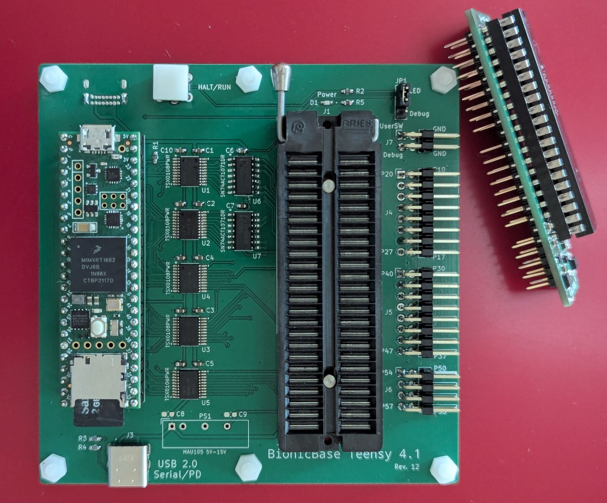
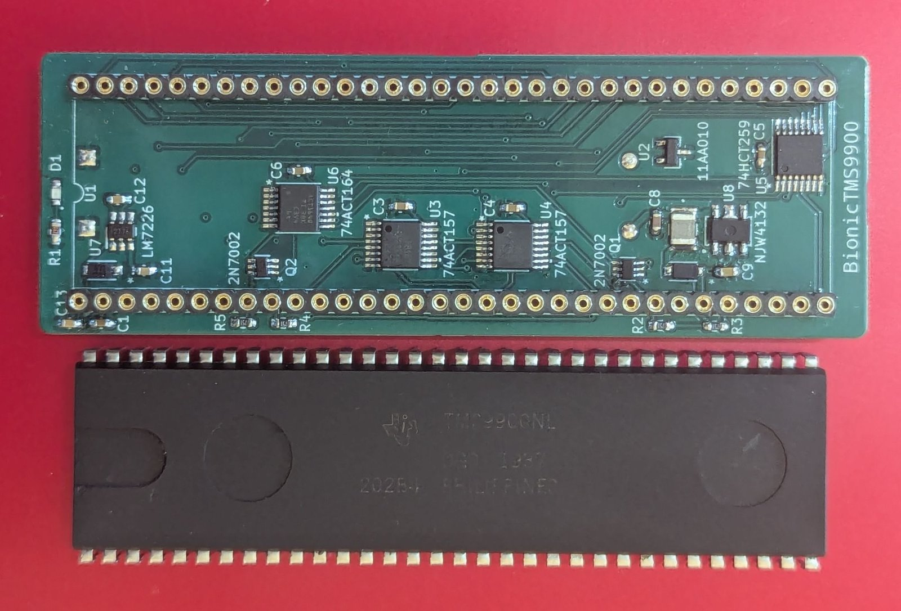
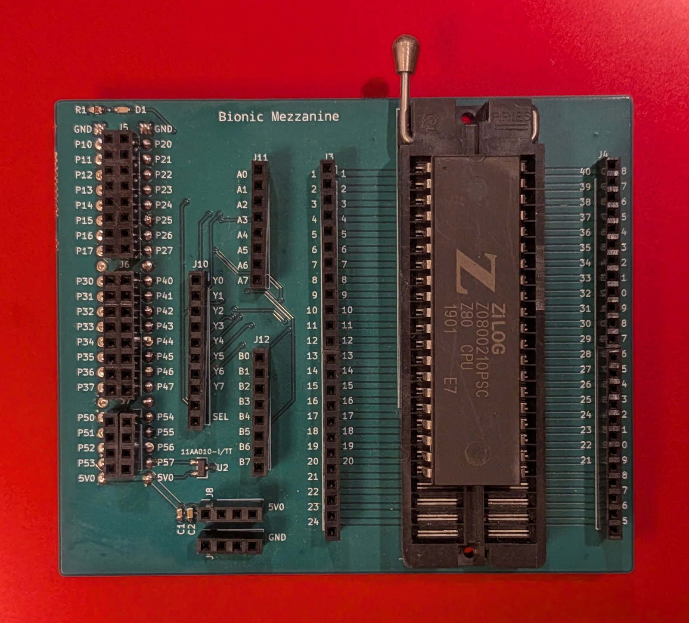

# Hardware

Two boards make a working system — a base and a CPU adapter. Only the adapter changes when
you swap processors. A third board, the mezzanine, is a bench aid used while bringing a new
CPU up; a finished adapter does not need it.



## 1. Base — `schematics/base/`

*BionicBase Teensy 4.1*, the constant part of the system.

| Part | Purpose |
|---|---|
| Teensy 4.1 (MIMXRT1062DVJ6A) | Cortex-M7 at 600 MHz — generates the clock and drives every bus cycle |
| 6 × TXS0108EPW | Bidirectional 3.3 V ↔ 5 V level shifting, 8 bits each |
| 7 × SN74ACT1071DR | Bus terminators with hold, so multiplexed buses keep their value |
| 48-pin ZIF socket | Accepts the mezzanine or a CPU adapter |
| HALT/RUN switch | Interrupt-driven break into a running program (`PIN_USRSW`, pin 24) |
| USB 2.0 Serial/PD | Power and the two serial ports |

The Teensy's own USB port carries the debugger console. The second USB serial port is the
**software HALT** — see [build.md](build.md).

## 2. CPU adapter — 46 boards

One board per processor, and usually almost empty: the CPU, its identity EEPROM, a couple of
LEDs, decoupling, and two 48-pin connectors down to the base. Everything else is the base
board's job.

Two things push parts back onto the adapter:

- **Power.** Boards needing more than 5 V generate it themselves. `schematics/tms9900/`
  carries `dcdc+12v.kicad_sch` and `dcdc-5v.kicad_sch` because the TMS9900 wants multiple
  rails and a **12 V four-phase clock**.
- **Address width.** CPUs with a large address space carry an **address bus multiplexer**,
  so more address lines than the connector has can be presented in groups. The TMS9900
  board below uses a pair of `74ACT157` for exactly this.

Some processors get two boards for two packages — `z180` exists as `bionic-z180f` (QFP) and
`bionic-z180v` (PLCC), with separate gerber sets.



Above: the BionicTMS9900 board and its 64-pin TMS9900NL. Almost everything on the board
exists to feed that one chip — the `11AA010` identity EEPROM, two `74ACT157` multiplexers, a
`74ACT164`, and the regulator and DC-DC parts that produce the rails and the four-phase
clock it needs.

Every board has a rendered PDF schematic next to its KiCad project, e.g.
[`schematics/mc6809/bionic-mc6809.pdf`](../schematics/mc6809/bionic-mc6809.pdf).

## 3. Mezzanine — `schematics/mezzanine/`

A prototyping board, not a required layer. It carries a CPU socket, two 74HCT157
multiplexers, an 11AA010 identity EEPROM and an indicator LED, and is used to bring a new
processor up on the bench before its own adapter is designed. Finished adapters plug
straight into the base.



Above, mid bring-up with a Zilog `Z0800210PSC` in the socket. Every one of the 48 connector
signals is broken out to a labelled header — `P10`–`P17`, `P20`–`P27`, `P30`–`P37`,
`P40`–`P47`, `P50`–`P57` — alongside the multiplexer inputs and outputs, so a new CPU can be
wired up by hand and probed before its adapter is laid out.

## Signal naming

The 48 lines crossing the connector are named `P10`–`P17`, `P20`–`P27`, `P30`–`P37`,
`P40`–`P47`, `P50`–`P57`. What each carries depends on the CPU's bus style, which is why
[`pinout/bionic_connector.toml`](../pinout/bionic_connector.toml) has one column per style —
8-bit multiplexed, 8-bit with 16-bit address, 16-bit multiplexed, 16-bit data:

```toml
name = "Bionic Connector"
dip = 48
#          AD8,  D8, AD16, D16
#          A16, A16,  A20, A12
 2 = "P10, AD0,  D0, AD00, D00"
23 = "P53, #RESET"
26 = "P57, #USR_LED"
27 = "P56, #USR_SW"
32 = "P46, CLOCK"
```

Each CPU board then maps its own pinout onto those names in a `*_bionic.toml` file:

```toml
name = "MC6809"
title = "MC6809/HD6309"
dip = 40
 2 = "P51, #NMI"
 8 = "P20, A0"
16 = "P30, A8"
24 = "P17, D7"
32 = "P41, R/W"
34 = "P47, E"
37 = "P53, #RESET"
```

## Board identification

Every adapter carries a Microchip **11AA010** UNI/O serial EEPROM holding a 16-byte name.
At boot the firmware bit-bangs the UNI/O protocol on pin 34 (`PIN_ID`), reads the string,
and instantiates the matching target — this is why one firmware image serves all 40 CPUs.
Holding the user switch low during reset forces the null target instead. The `W` command
writes a new identity string.

## Awkward chips

The bus-cycle timing diagrams at the top of each `debugger/*/pins_*.cpp` are the real
documentation for how a given CPU is driven. A few examples of what made them hard:

- **TMS9900** — a four-phase 12 V clock had to be generated before anything worked at all.
- **W65C816S** — in native mode the bank address appears on the data bus, colliding with
  read data. Fixed with an `SN74ACT1071` bus terminator holding the value between phases.
- **NSC800** — multiplexed bus, with the instruction held until the adjacent refresh cycle.
- **P8051** — the delay from clock edge to control signal is about 50 ns, roughly half a
  cycle at the target speed, and the external clock phase differs between HMOS and CMOS parts.
- **TMS370Cx5x** — an on-chip oscillator monitor decides a software-generated clock is
  unstable and resets the CPU.
- **P8095BH** — prefetches up to four bytes whenever the bus is free, and DIP-48 exposes
  neither NMI nor an instruction-fetch signal, so single-stepping uses TRAP instructions and
  the bus trace is reconstructed by pattern matching.
- **MC68HC08AZ0** — minimal control signals, no NMI, and instruction prefetch; every bus
  cycle is monitored to keep track.

## Manufacturing

Boards are designed in KiCad 8 and manufactured at JLCPCB as 2- and 4-layer PCBs. Gerbers
are committed next to each project, so any board here can be ordered as-is.
